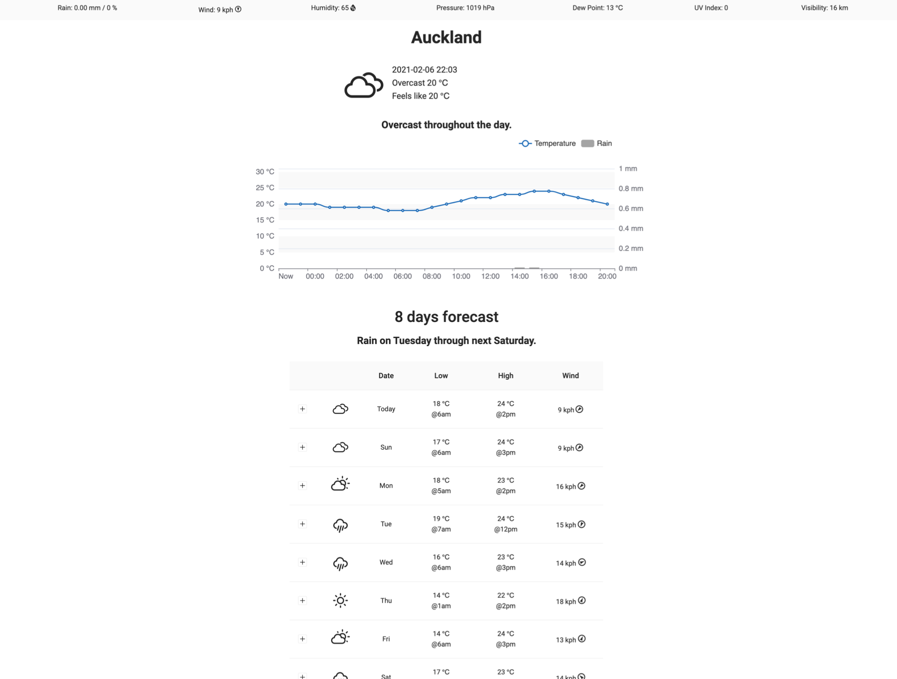

# Weather App

This website is fetching data from 
1- [here](https://www.metaweather.com/api/) or [here](https://weatherstack.com/documentation) or [here] (https://api.windy.com/)
If you face issue fetching the data maybe [this](https://stackoverflow.com/questions/43262121/trying-to-use-fetch-and-pass-in-mode-no-cors/43268098) helps.

## Requirements
Create an application that fetches data from one of the above API. 

1- the app functionallity should look like this you are free to better designs.check the examples down for inspirations**
 

## Optional

1- Background image of the web page changes according to the Weather.

***PS**: You are free to use a CSS framework.*

**Those are some [images](https://static.dribbble.com/users/2158940/screenshots/7376567/media/35649246137de1ce1d3f68d4ad1e1ffa.png) for [inspiration](https://static.dribbble.com/users/2158940/screenshots/7118235/media/1ea59d43e8e99a529220bed091f8eb84.png).*
